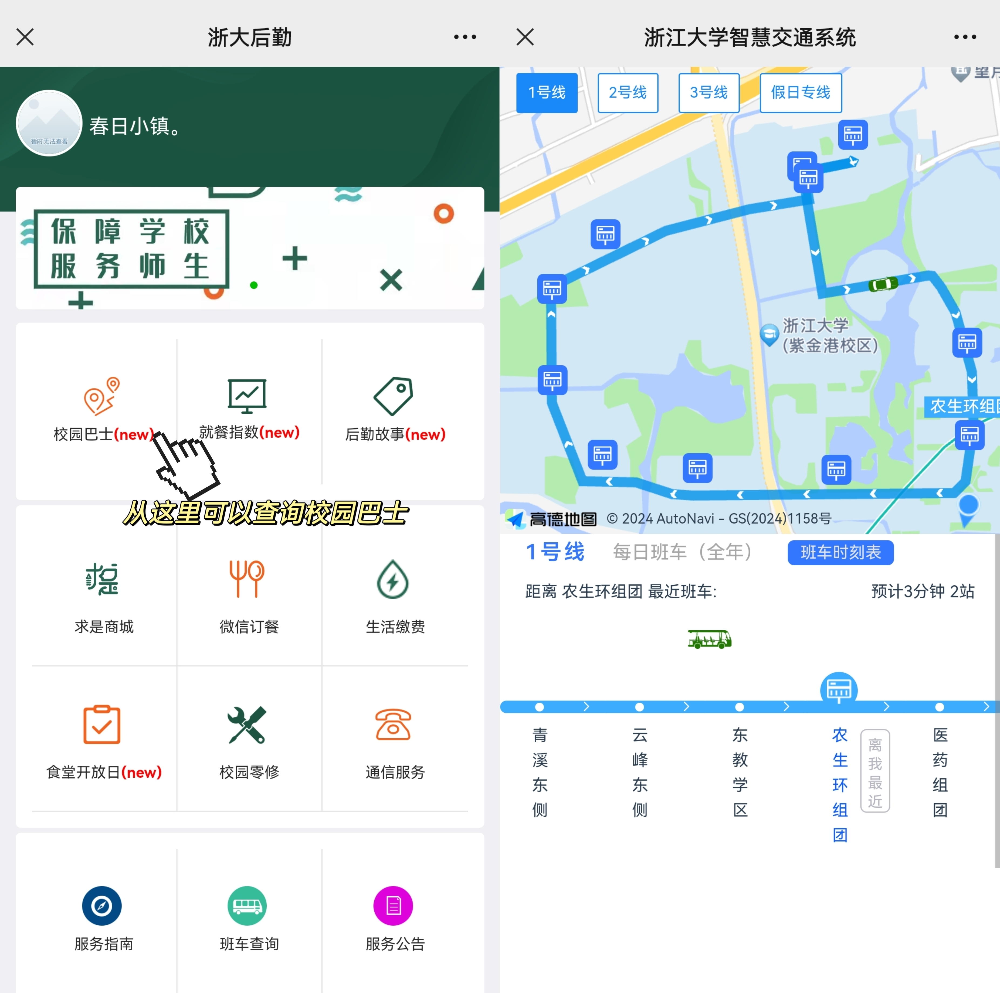

# 浙大生活指南
作为浙大的同学，也作为玉湖园区的居民。校内生活当然是必不可少的。
## 1. 关于吃饭
### 1.1 校内就餐
浙大紫金港校区有多个食堂，其中也包括了号称“亚洲第一大食堂”的大食堂。东西南北中，总有适合的美味。所有食堂均可校园卡或校园卡付款码消费。

!!! info "注意"
    部分食堂支持支付宝付款，但多收20%搭伙费。

1. 玉湖食堂
<ul>
    <li>距离：离宿舍非常近，离教学楼非常远</li>
    <li>分区：（一楼）智能餐厅；（二楼）自选区、风味区</li>
    <li>支付方式：除风味区可刷支付宝付款外，均需校园卡或校园卡付款码</li>
</ul>

  总体上玉湖食堂价格较为亲民。食堂一楼是智能餐厅，基本上都是自动化的服务，一些东南亚风味的饭以及一些简餐和盖浇面，砂锅。一楼门口还有个机器人服务。（悄咪咪：这个餐厅是刚刚启用不到一年的新餐厅。）

  二楼自选区就是小盘菜自己选然后一起结账，荤素都有，包括一些常见的家常菜，主食提供以米饭为主；风味区就是自己点的一些现做的饭，主要有麻辣烫和麻辣香锅、面食、叉烧饭、水饺以及民族窗口。
  
2.银泉食堂

- 距离：离宿舍稍远，离北教学楼最近，其他教学楼稍远
- 分区：（一楼）中餐（A区）、西餐（B区）；（二楼）西北风味、自选区、速选区；（三楼）银泉小乐惠、食天一隅
- 支付方式：除自选区、速选区要求校园卡或校园卡付款码外，均可支付宝付款

  银泉食堂的价格和品质都会略高一筹（我们认为总体上是校内做的比较好吃的一个食堂）。A区中餐一般是常见的面食、锡纸饭、麻辣烫和麻辣香锅等，B区西餐主要是牛排、意面等。

  二楼西北风味以陕西特色为主，例如biangbiang面、肉夹馍等，同时还有盖浇饭。自选区是一盘小菜自己选，速选区菜品种类更多一些，有咖喱饭、淮南牛肉汤、锡纸盒小食。最后强推一下速选区的烤鸭卷，是银泉食堂的人气小吃，推荐尝试。

  三楼两个餐厅都主要是以聚餐形式为主，风格上偏向于校外餐厅。其中银泉小乐惠以川菜为主（属于是不太辣的川菜）。消费水平比楼下要略高，推荐集体聚餐聚会前往。
  
3.澄月食堂

- 距离：离宿舍稍远，离教学楼适中
- 分区：共分为三层楼，菜品种类没有特别明显的分区
- 支付方式：均可支付宝付款

  澄月食堂因为靠近留学生宿舍，因此常常被简称为留食。其中一楼有中餐、西餐，包括面食、牛排、鸡扒饭、意面、麻辣烫以及米饭等，日常也是大家常去的餐厅。二楼暂时还未探索。三楼的风格偏向于餐厅的模式，且有包间，比较适合集体聚餐，菜品一般是一些家常菜。
  
4.东区大食堂

- 距离：离宿舍较远，离东、西教学楼较近（北教学楼除外）
- 分区：（一楼）自选餐厅、风味餐厅；（二楼）东区食堂、西区食堂；（三楼）餐厅
- 支付方式：除自选区和两个二楼的食堂要求校园卡或校园卡付款码外，均可支付宝付款

  东区最大的食堂，是求是学院的同学经常会去到的地方。同学们从东区下课的话可以去那边吃，相比于其他食堂，东区大食堂的“有饭时间”会比较长。东区大食堂风味区的一楼还有买面包的地方，可以在那边买个面包当早餐。下午也会卖一些散装的小食品。

  自选区和玉湖自选区风格类似，风味区主要有汉堡、米饭套餐、面食等；二楼的餐厅除西区食堂部分窗口采用点菜现做外，大多采用打饭的形式。三楼一般需要搭乘电梯，就是比较正规的聚会场所，风格也是很像酒店的样子。

  大食堂一楼的风味餐厅是笔者目前见到的全校开门时间最久的餐厅。两个饭点之间的时间基本都是开门的，想要暂时休息以及等餐可以选择这里，笔者有次和朋友点了夜宵就是在风味区吃的。

5.临湖食堂

- 距离：离宿舍较远，离教学楼最近（北教学楼除外）
- 分区：一楼餐厅、二楼餐厅
- 支付方式：要求校园卡或校园卡付款码

  由于浙大排的课表中，中午只有一个小时时间吃饭和午休，所以如果早上和下午连着上课，且都在东教的话可以选择去这两个餐厅，排队可能比较多，不过比较快。

  临湖食堂是大家在上课期间常去的食堂之一。其中一楼的窗口较少，属于是打饭的形式，荤素可搭配自选。二楼主要是鸡排、猪排以及一些面食和米饭套餐。

6.麦斯威

- 支付方式：可校园卡及其付款码，也可支付宝付款

  麦斯威分布于浙大校园的各个位置，最主要的有位于东二教学楼的麦斯威餐厅（共两层，可提供正餐），若是上下午的课程均在东教可以考虑去这里，因此也常被称为学霸餐。

  除此以外，在其他教学楼、部分图书馆等位置也分布有麦斯威咖啡，可以进去买面包和咖啡等。
  
7.校内小食、饮品店

- 支付方式：微信或支付宝付款，大多可以小程序下单，部分商家会有小优惠

  学校里分布有各式各样的小食店、饮品店等，其中比较出名的有：
  
  （1）肯德基：位于银泉食堂一楼，不支持外卖服务。一般周四排队很长
  
  （2）古茗：银泉食堂对面、玉湖教超里各有一家，不能外卖点餐，可以自取
  
  （3）瑞幸：玉湖教超旁
  
  （4）星巴克：银泉食堂对面，和银泉古茗很近
  
  此外，在其他园区也有一些奶茶店、咖啡店，例如临湖教超的库迪咖啡、东区的茶百道等，大家可以多多探索
  
8.校内教超、全家：

- 支付方式：教超支持校园卡或支付宝、微信支付

  普通超市有的东西基本都有，每年四六级考试前还会专门准备考试用具供同学选购。校内的全家是24h营业的，且配备了微波炉可以加热一些菜品。如果早八赶不及了还可以去教超以及全家超市买面包和早餐。
### 1.2 校外就餐
紫金港校区周边还是很丰富的，东面有剑桥公社、堕落街等小食街，北面有北街烧烤，是浙大人常去的聚会场所。西面和南面有西溪银泰和西溪天街，都有很多不错的吃饭去处，日料、火锅、地锅鸡、潮汕菜、建德菜、湖南菜、新疆菜等等都有。同时天街负一楼还有盒马生鲜，如果你恰好有会员，可以在盒马会员日去吃个海鲜。总之大家可以多多探索。
## 2. 关于穿衣
这一条主要是给来自北方的同学，杭州的气候不能说是风调雨顺也只能说是“极其恶劣”。（所谓“人间天堂”——不是给人住的。bushi）充分诠释“杭州、沆州、炕州”的真谛。杭州一般的气温区间在0℃（冬季）-30+℃（夏季）。浙里由于湿度偏大，所以总有魔法攻击，热的时候温度可达40℃，加上空气潮湿，实现360°无死角爆热；冷的时候逼近0℃，可能会遇到0℃的下雨天，加上空气潮湿，实现360°无死角爆冷。这里建议同学们准备好防风厚手套以及厚袜子，厚鞋子，最好还有暖手宝，以备冬天的寒冷魔法攻击。

夏天梅雨季节基本天天暴雨，充分诠释“尿频，尿急，尿不尽”，最好备好雨伞。对于没有掌握单手骑车技能的同学来说最好买一个雨披。此外最好在梅雨季穿防水的鞋子（可以考虑密封性较好的鞋子或者直接凉鞋），不然会换鞋换到发疯。
## 3. 关于住宿
笔者认为玉湖园区的宿舍是紫金港最好的宿舍之一，住的方面其实没什么要说的，就是要勤打扫、及时通过浙大学生公寓微信公众号上的IHOME服务交电费以及订水。同时这个公众号还能够支持在线报修，如果寝室里一些设备坏了可以考虑在线操作或者告诉楼长。

- 空调是需要租的，南方还是很需要的，既可以制冷也可以供暖，还可以除湿。要记得买一些除湿袋挂在衣柜以及床头，不然没有干衣服。如果你觉得需要还可以在网上买便携的烘衣器，这样在梅雨季也可以有干燥的衣服。

- 床上挂帘子可以提供一个私密的空间，如果你在意可以买一个，通过手机的测量工具可以测距离买到合适的帘子。最好买带蚊帐的那种，不然夏天蚊子可能把你咬到崩溃。

- 玉湖宿舍7幢的1.4.5.6楼、6幢的1楼都有洗衣机，通过“兰德力自助洗”这一公众号可以预约洗衣机或者直接扫码空置洗衣机进行洗衣服的操作，如果你洗衣服比较频繁，那么买一张小蓝卡可以打5折，是比较有性价比的。（由于寝室结构的原因，我们并不建议自购洗衣机，容易没地方放。）

需要提醒的是，宿舍晚上23:35会断电（6、7幢一楼大厅除外，大厅会24h供电），有夜间学习需求的同学可以买充电式台灯，也可以在宿舍外或宿舍大厅找地方自习。宿舍没有宵禁，不管几点都可以刷脸进入宿舍。

!!! warning "特别强调"
    电瓶车、平衡车电池均禁止带入宿舍；打火机等火源禁止私自使用。被抓到是会受到处分的！其他大功率电器（尤其是发热电器）需要找宿管办审批，如果被发现私自使用也是会被没收的。

    日用设备如吹风机等，用后一定要拔下插头收好，不然会有火灾风险。学校安排的一些安全宣传活动中也会多次提及用火用电安全，大家要多多留心，多多小心。

宿舍楼里没有火源，如果需要过生日点蜡烛等可以向阿姨借用一下打火机（注意安全并及时归还），但是烧火做饭是绝对不可以的。
## 4. 关于通勤
### 4.1 校内：
由于玉湖宿舍位于校区西边，而一般教学楼在东区，因此是距离教学楼最远的宿舍。根据经验，一般单次单向通勤为2-2.5km，所以前去上课比较痛苦。建议同学们买一个自行车或者电动车（我们称为小龟），或者乘坐校内班车实现通勤。

校内班车有两种，一般被称为“小白”和“宝宝巴士”，其中小白车更多。校内班车工作日一般15分钟一趟，双休与节假日、暑期30分钟一趟，寒假不运行。它们的实时信息可通过“浙大后勤”或“浙大生活”公众号查询。例如：

两个公众号均使用了浙江大学智慧交通系统。节假日与寒暑假期间可能有部分线路调整，届时这些通知将会通过上面两个公众号发布。

自行车可以停在宿舍底下的车库，电动车需要停在外面**（千万不能停在宿舍园区内）**，在玉湖旁边的艺博馆有充电桩，另外，宿舍区周围会有共享单车以及共享电动车供同学们选择。如果你不会骑车，首先我建议你学会，其次可以选择在食堂门口坐小白车，在浙大钉以及浙大生活公众号中都可以查询发车时间。从宿舍到东教，自行车大概需要10-15分钟的时间，走路的话半小时起。上课时间如果经过基础馆门口会很堵，一定要注意交通安全。

如果自行车或电动车出现了或大或小的问题，包括但不限于链子掉了、轮胎没气了、刹车松了等，可以到蓝田学园2舍的楼下，邴师傅（读音：bing，三声）修车铺去修理。这家商铺是校内的五星级商铺，经济实惠而且服务好。当然，如果你需要配钥匙，也可以找邴师傅。

最后，学校里在宿舍区和教学楼等地分布有众多共享单车和共享电瓶车，不打算自己买自行车或电动车的话可以选择使用。同时浙大钉系统目前已经允许扫码使用共享电动车，安保处承诺通过这种方式可以享受六折优惠，可以多多尝试。
### 4.2 校外
如果想要出校玩的话，选择也很多。如果想去别的校区看看，可以在浙大钉以及浙大生活公众号查询跨校班车班次，坐班车过去。如果想去杭州的各个景点转转可以乘地铁，紫金港校区周围有三个主要的地铁站：

- 西三门出门左转，过桥后再过马路就是五号线蒋村地铁站
- 南大门出门右转，或南二门出门左转是五号线浙大紫金港站
- 东二门出门左转，在十字路口右转，在下一个十字路口左转直行是二号线虾龙圩站
- 
或者，大家也可以高德or滴滴叫个车。网约车可以凭借大家的订单进入校园（前提是给到网约车的订单地址的起始点在校内），如果选择乘坐网约车回校可以在门口向保安出示浙大钉信息进校。

如果杭州玩腻了，可以乘坐高铁在江浙沪玩，城战离紫金港比较近，但是车次没那么多，杭州东站车次很多，不过过去需要留出一小时左右的通勤时间。不过需要提醒同学们的是，如果想去周边城市玩，记得看一下你想去的地方距离那座城市高铁站的距离是不是比你直接从紫金港过去还远，这种情况你可以直接叫个车，如果多人一起去的话也不是很贵。
## 5. 关于日常
每个人的生活方式都不一样，日用品也不尽相同，所以这一部分主要说明一些购买日用品和学习用品的渠道。

首先是网购，身处包邮区，网购是很方便的，例如纸巾、洗发水之类的产品会比教超中便宜不少。值得一提的是拼多多上的二手书很便宜。玉湖楼下就有一个菜鸟驿站，填对地址：

!!! note "收件地址"
    所在地区: 浙江省杭州市西湖区三墩镇   
    详细地址: 余杭塘路866号浙江大学紫金港校区西区学生生活组团菜鸟驿站

其次要善用CC98和朵朵校友圈，上面会经常有学长学姐出二手用品，可以通过这两个平台交易。CC98还有98淘书的衍生小程序，可以在上面找需要的教材。对比蓝田旁边的二手书店标价打五折的卖法会便宜很多。有一些教材在淘宝等网络平台也能够买到（例如线代2的教材）。

最后就是找学长学姐礼貌询问（主要是教材），如果你的态度良好且学长手中恰好有你闲置的你需要的课本，那么大多数学长会将课本传承给你。但是需要强调的是，这些教材并不是义务给你的，同学长交流的时候要注意自己的用词以及礼貌问题。 正所谓“一书传三代，人走书还在”，当你发现某一本书上的署名是你的学长的学长的学长的学长的时候，~~历史实现了闭环~~。

这里还是希望大家管理好自己的生活费，舒适地度过自己的大学时光。
