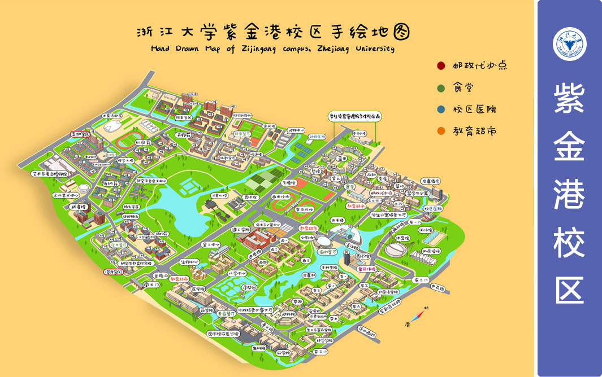
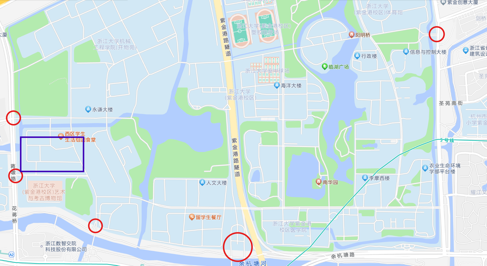

# 新生报道流程
现在，让我们从头体验入学报到的流程

!!! info "注意"
    以下部分信息来自于22级与23级同学。学校已经随录取通知书附带了《新生入学须知》，若有不同还请以入学须知通知为准
    
## 1. 线上部分
### 1.1 新生注册
根据入学须知中的步骤和时间进行注册（**在规定时间前，由于系统暂未开放，是无法注册的**），用户名为通知书中的学号。

!!! info "注意"
    统一身份认证是伴随大家整个本科期间的唯一身份认证，请务必牢记用户名和密码，后续很多场合都会用到。

### 1.2 网上注册
网上注册我们一般使用浙大钉完成。

??? note "什么是浙大钉？"
    浙大钉是钉钉的浙大定制版。下载后会根据留存的个人手机号码发送邀请进入“浙江大学”的通知，点击同意即可加入浙大的组织架构，并获得高级认证

- 确认手机号码。通过扫码确认绑定的号码；
- 下载并登录浙大钉；
- 进入浙大钉“工作台”——“迎新”，按照提示要求完成各个步骤，结束网上注册。

!!! warning "注意"
    1、手机号码请务必留存学生本人的手机号。
    
    2、统一身份认证是伴随大家整个本科的唯一身份凭证，请务必牢记用户名和密码，后续会用到很多（基本上绝大多数学校的网页都需要统一身份认证）。
    
### 1.3 学费缴纳
学校现场不设置收费点，我们一般会在线缴费；对于家庭困难学生，切记在注册时选择“绿色通道”并办理学费缓缴：

- “浙大钉”APP内自助缴费
- 支付宝或微信扫描入学须知中的二维码自助缴费
- 通过“浙江大学计财处”微信公众号智能财务自助缴费
- 登录浙江大学收费平台（http://pay.zju.edu.cn） 按照提示缴费

如果由于支付限额导致无法缴费，可以采取如下方法解决：

- 确保钱包余额足够
- 分多次缴费
- 若已开通**中国银行手机银行**,可使用手机银行进行缴费
- 进入浙江大学收费平台完成银联支付
- 报到当天到学校计财处学费专窗缴费

### 1.4 MOOC及相关课程
1.新生养成教育MOOC

通过“学在浙大”或浙大钉进入MOOC页面，完成所有章节的知识学习和测试。最终成绩达到90分视为通过，可后续自动获得0.5分第二课堂记点。建议大家随手刷刷，可以很好地了解一些学校的基本情况，而且本身也并不是很难。

2.高等数学先修课

这个其实学不学无所谓。如果大家比较感兴趣可以看一些前面的内容，或许后续可以更快地进入学习进程中。这一部分的知识点难度也是比较低的，主要以了解一些新概念为主（例如反三角函数、邻域等内容），是高中知识的一个的补充。我们上课的时候老师会默认大家了解这些东西。

3.计算机先修课

和上面的高等数学先修课类似，根据自己基础选择性地听就好。不过我们学习的C语言，这一部分如果看的话可以快速过掉Python部分。

3.英语能力测试

这个测试主要是为了给大家预置第一个学期的英语课程。结合高考成绩和测试分数，学校会给大一新生预置难度不同的《大学英语3》、《大学英语4》两门课程。

不过我们混合班作为荣誉学院的一类班级，我们并不需要修读英语课程。因此这一部分大家可以自由选择，如果希望了解一下英语能力也是可以做一下的。
### 1.5 大学生医保
入学时间段学校以及相关部门会发布相关的通知，大家可以根据需要选择参加本年度9-12月的大学生医保。具体信息以官方通知为准。
## 2. 线下部分
### 2.1 进入学校
浙江大学的新生统一入住紫金港校区。浙江大学紫金港校区位于**浙江省杭州市西湖区**。可利用高德地图等APP搜索到。学校周边路网及地铁站等配套设施完善。

- 自驾进入学校，可通过“迎新”——“基础信息”栏目填写中填写信息
- 亲友入校可以在浙大钉的“访客预约”栏目填写信息，凭身份证刷卡入校
- 出租车、网约车进入学校，可凭订单进入学校。

总之，路上注意安全。
### 2.2 进入宿舍园区
紫金港校区很大，首先需要了解我们的宿舍园区，之后的入学报到流程绝大多数都能够在园区内完成（~~不需要跑来跑去，爽！~~）以下是我们代代传承的紫金港校区手绘地图：

我们的宿舍区在图中最左侧的“玉湖园区”。临近可以选择入校的校门有：

- 西三门（最近）/西二门：靠近5号线“蒋村站”
- 南二门/南大门：南二门相对更近，但也比较小不太容易发现，日常很少作为机动车通行路口，较适合步行来校。两个校门均在5号线“浙大紫金港站”附近
- 东二门：比较远，而且会聚集很多人，若非必要不建议从这里入校。靠近2号线“虾龙圩站”。

以上校门我们在下图所示的地图截屏中已经用红色圆圈标注，紫色矩形是我们的宿舍位置：

我们比较建议从西三门/西二门或南大门入校。南二门目前一般只有行人通行，驾车可能会无法进校。入校后请跟随工作人员指示在指定位置停车后再搬运行李，不要占用机动车道（学校的校门口基本都是双向单车道）。
### 2.3 找到学长组
学长组是迎新的主力，我们非常乐意见到大家、帮助大家。

学长组成员均**身着黑色短袖上衣，佩戴学长组工作牌**，请千万记住特征以找到正确的学长组工作人员，看到其他的人请不要轻易相信（可能会收取一定好处费或者让你买卡，千万别信）。我们将会帮助大家**免费**搬运行李、分发物资以及提供指引。
### 2.4 完成园区入住等流程
迎新的主要流程范围在宿舍楼一楼大厅、地下自行车库以及玉湖6/7幢外部的中庭位置。

大家可以在园区宿舍大厅一楼领到自己的宿舍钥匙、校园卡等，可以将行李搬到寝室。后续根据园区标示牌和工作人员指引，完成线下注册、新生大礼包领取、军训服装领取以及后续的银行卡办理等相关事项。即可完成整个新生报到流程。

如果线下部分有任何疑问，可咨询在场的任何一个工作人员询问，我们将为大家提供必要的帮助 ~~竭诚为您服务~~
