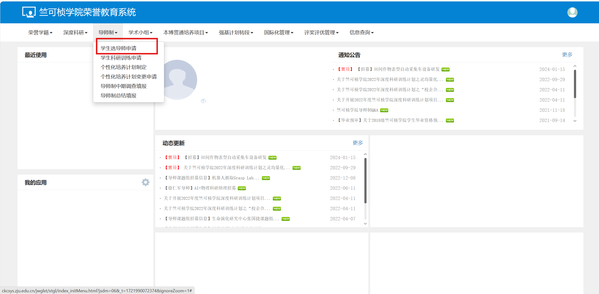
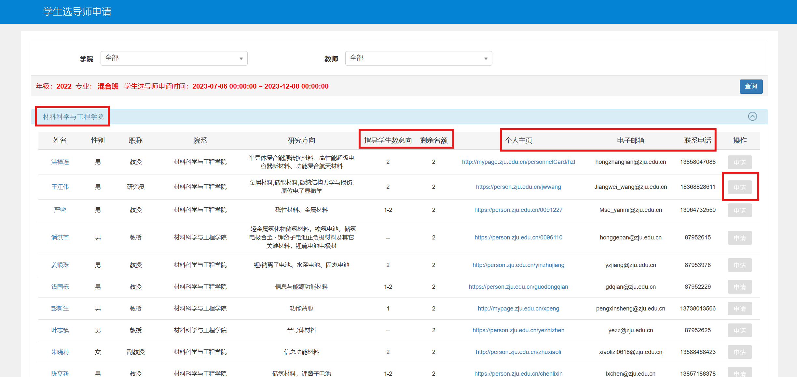
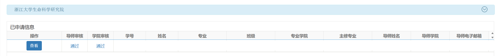
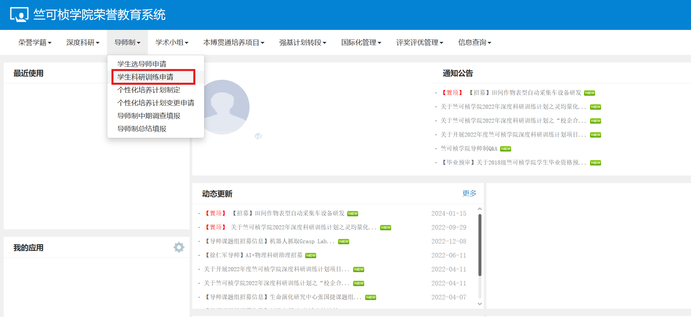
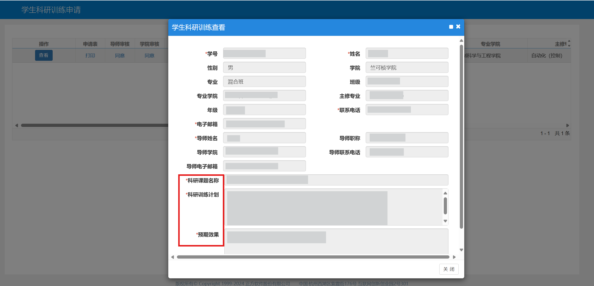
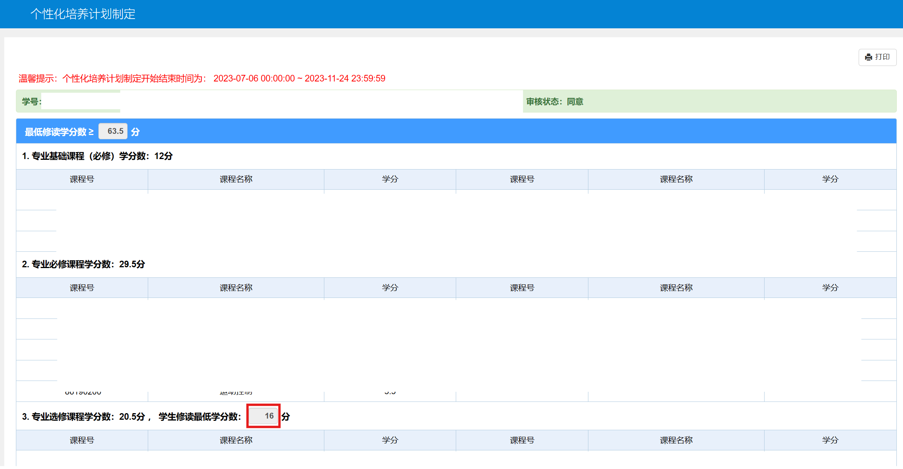
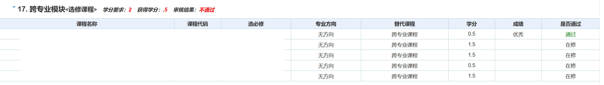
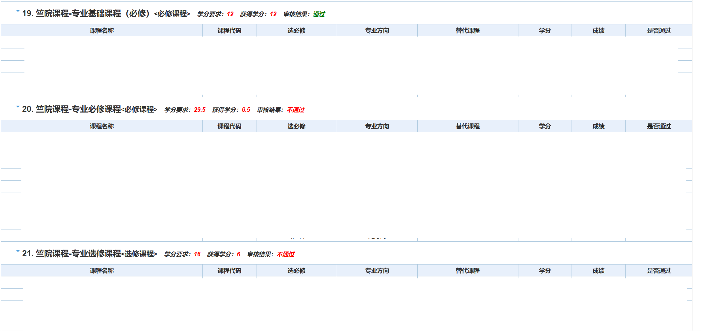

# 导师制/教授学术小组流程指南
## 1. 导学关系建立
!!! info "提醒"
    竺院每年的通知中会附带详尽的系统操作指导，建议优先参考官方文件掌握系统操作。如有变更还请以当年通知为准。

    我们这里主要借用流程介绍一些具体实操中可能存在的其他问题，供大家参考。

参与导师制/教授学术小组的同学需在竺可桢学院荣誉教育平台[http://ckcsys.zju.edu.cn/](http://ckcsys.zju.edu.cn/)。进入“导师制”栏目（有意向加入教授学术小组的同学可直接进入“学术小组”栏目）。

根据导师制政策，大家可以跨学院选择导师。可进入导师所在学院查找导师。如果你有其他意向的导师并不在导师库中，例如通过学校某公众号发现某导师的方向符合自己发展方向，可考虑将导师增加到导师库中。主要需要考虑以下问题：

- 导师库中的导师原则上要求具备博士研究生招生资格
- 进入导师库并且确定导学关系是经过导师同意的

如果满足以上条件，可以邀请导师加入导师库。后续和学院沟通相关事宜并请学院审核通过，即可在导师库中选择该导师。

??? abstruct "如何找到一个适合的好导师"
    如果你已经有心仪的导师，请跳过。

    如果你不知道哪个导师适合自己，我们给出一些参考：

    - 请确认自己希望的研究方向。导师制/教授学术小组页面均写明了导师的研究方向作为参考，可以选择适合自己未来发展方向的导师。
    - 进入教师个人主页（网站中部分老师的主页是浙大的教师个人主页，部分老师提供了自己实验室的网站）查看老师的一些研究信息
    - 根据“査老师”、“CC98论坛”等可以咨询或查看老师在本科生培养、研究生培养中的态度和风评
    - 可通过知网等搜索导师近年发表的一些论文和文献，大致推测导师的研究方向以及科研教学水平。

    !!! warning "注意"
        一些老师在本科生和研究生培养中的表现和风评不同，请结合自身需要审慎考虑。

确认导师意向后，大家需要先行联系导师，导师一般会和大家有简短的交流。网页提供了导师的电话与邮箱。我们一般的联系方式有：

- 如果能够线下找到导师，条件允许的情况下更推荐线下拜访交流。
- 如果只能线上联系导师，推荐使用浙大邮箱[https://mail.zju.edu.cn/](https://mail.zju.edu.cn/)发送邮件。

???+ tip "发送邮件但是导师没有回复怎么办？"
    一般导师无论是否拒绝均会给予回复。若没有回复，常见的原因为：导师收到的邮件过多，你发送的邮件被淹没了。

    一些小技巧：依靠浙大邮箱的“定时发送”功能，将邮件发送时间设置为工作日早上8时左右，导师开始工作时一般会先查看邮箱，这时我们的邮件通常会处于上方，最容易被看到。

依次经过导师、专业学院和竺院三方审核，导学关系建立。导师若一直未审核可联系导师，导师审核后方可学院审核。部分学院审核较慢或会统一审核，请耐心等待。

## 2. 学生科研训练申请
导学关系确认后，需制定科研训练计划和个性化培养方案。

同样地，进入“导师制”/“学术小组”栏目，进入“学生科研训练申请”/“学术导学培养计划申请”。根据提示填写相应的内容。此处以导师制为例：

填写信息一般为科研课题名称、科研训练计划和预期结果三部分。作为大家导学关系的计划执行和考核，对于填写内容，竺院主要尊重导学双方的意见。部分导师会让大家咨询他的研究生，大家可以在学长和导师共同指导下完成这一部分的填写。

## 3. 个性化培养方案制定
根据自己所属专业学院的要求，完成个性化培养方案部分。主要包括：专业基础课、专业主修课、专业选修课三部分。实践教学环节和毕业设计（论文）会在系统上自动生成并标注必修或选修

经过与导师的沟通后，在满足专业学院要求的基础上形成该培养方案。除预先设置外，其他部分的课程目录最初为空白名录，需要通过检索功能依次添加。

添加时，为保证安全，建议通过课程名称与课程代码双验证方法进行查找，以防止多个学院开设相同名称的专业课（例如，光电学院和信电学院均有课程《电磁场与电磁波》，同名但不同代码，不可相互替换）。在填写完毕后仔细核对，以免影响到后续课程修读。

在专业选修课部分，还需要额外手动输入最低学分。这一部分的课程理论上可以容纳全校的所有课，包括其他专业乃至学院的课，且系统并无上限设置，例如添加100门课程作为选修课并不会受到系统阻止。但专业院系可能由此打回个性化培养方案要求修改。 ~~所以当个乐子就好，别真去实践~~

??? abstract "个性化培养方案与毕业资格自审的关系"
    在个性化培养方案制定前，毕业资格自审部分没有专业课信息。大家此时修读的专业课被视为“跨专业课程”，例如：

    

    在添加专业课程后，基础课、主修课和选修课将会在毕业资格自审中增加三部分：

    

    可以这么理解：个性化培养方案相当于嵌入混合班培养方案中。

持续补充完善ing